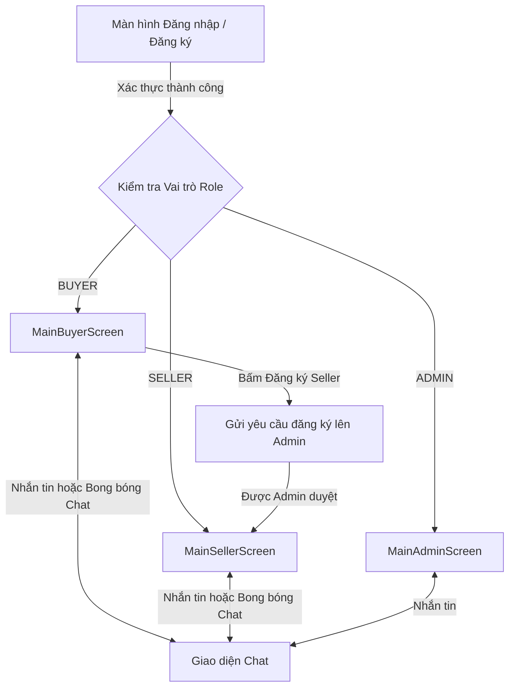

# 📘 Walkthrough: Các Use Case & Activity của TAUT Shop (Groceries App)

Ứng dụng **TAUT Shop** được xây dựng trên nền tảng **Android** sử dụng **Kotlin**, **Jetpack Compose** cho giao diện, **Firebase** (Authentication, Firestore, Storage) cho backend, kết hợp với kiến trúc **MVVM** và thuật toán **Cosine Similarity** để gợi ý sản phẩm thông minh.

Tài liệu này cung cấp cái nhìn chi tiết về cấu trúc các thành phần giao diện (Activity/Screen), luồng điều hướng (Navigation), và toàn bộ các Use Case chính phân theo từng vai trò người dùng (BUYER, SELLER, ADMIN).

---

## 1. ⚙️ Android Activity vs. Jetpack Compose Screen

Trong các ứng dụng Android truyền thống, mỗi màn hình thường tương ứng với một `Activity` riêng biệt. Tuy nhiên, **TAUT Shop** áp dụng mô hình **Single-Activity Architecture (Kiến trúc Đơn Activity)** hiện đại với Jetpack Compose:

### 1.1 Android Activity thực tế
* **[MainActivity](file:///d:/GitHub/dacs3_shopapp/dacs3/app/src/main/java/ltdd/dacsba/groceries/MainActivity.kt)**: Đây là **Activity duy nhất** được khai báo trong tệp cấu hình [AndroidManifest.xml](file:///d:/GitHub/dacs3_shopapp/dacs3/app/src/main/AndroidManifest.xml).
  * Làm điểm khởi chạy (Launcher Activity) cho toàn bộ ứng dụng.
  * Thiết lập giao diện Compose (`setContent`) và chủ đề ứng dụng (`GroceriesTheme`).
  * Chứa bộ điều hướng gốc **[AppNavigation](file:///d:/GitHub/dacs3_shopapp/dacs3/app/src/main/java/ltdd/dacsba/groceries/ui/navigation/AppNavigation.kt)** để quản lý việc chuyển đổi giữa các phân hệ.

> [!NOTE]
> Trong gói `data.model`, có tệp tên là **[SellerActivity.kt](file:///d:/GitHub/dacs3_shopapp/dacs3/app/src/main/java/ltdd/dacsba/groceries/data/model/SellerActivity.kt)**. Đây **không phải** là một thành phần Activity của Android, mà là một lớp dữ liệu (Data Class) dùng để ghi lại lịch sử hoạt động/nhật ký của người bán (ví dụ: "Thêm sản phẩm", "Cập nhật đơn hàng").

### 1.2 Các màn hình chính (Compose Screens)
Ứng dụng được chia làm 5 thư mục màn hình chính trong gói `ui.screens`:

1. **[login](file:///d:/GitHub/dacs3_shopapp/dacs3/app/src/main/java/ltdd/dacsba/groceries/ui/screens/login)**: Giao diện xác thực.
   * `LoginScreen.kt`: Màn hình Đăng nhập.
   * `RegisterScreen.kt`: Màn hình Đăng ký tài khoản mới.
2. **[user](file:///d:/GitHub/dacs3_shopapp/dacs3/app/src/main/java/ltdd/dacsba/groceries/ui/screens/user)**: Giao diện dành cho **Người mua (BUYER)**.
   * `MainBuyerScreen.kt`: Màn hình chính Buyer, chứa thanh điều hướng dưới (Bottom Bar).
   * `BuyerHome.kt`: Trang chủ hiển thị danh mục, tìm kiếm, sản phẩm và gợi ý.
   * `BuyerCartScreen.kt`: Giỏ hàng của người dùng.
   * `BuyerCheckoutScreen.kt`: Đặt hàng, chọn địa chỉ và phương thức.
   * `PaymentQrScreen.kt`: Thanh toán qua mã VietQR động.
   * `BuyerOrderScreen.kt`: Lịch sử đơn hàng của người mua.
   * `BuyerProfileScreen.kt`: Trang cá nhân, nơi cho phép đăng ký làm Seller.
3. **[seller](file:///d:/GitHub/dacs3_shopapp/dacs3/app/src/main/java/ltdd/dacsba/groceries/ui/screens/seller)**: Giao diện dành cho **Người bán (SELLER)**.
   * `MainSellerScreen.kt`: Màn hình chính Seller, tích hợp Bottom Bar riêng cho người bán.
   * `SellerDashboardScreen.kt`: Dashboard doanh thu theo tuần, gần đây và các thống kê.
   * `SellerProductScreen.kt`: Quản lý danh sách sản phẩm của cửa hàng.
   * `SellerAddProduct.kt` & `SellerEditProduct.kt`: Thêm/Sửa thông tin sản phẩm (tên, giá, hình ảnh, tag nhãn).
   * `SellerOrderScreen.kt`: Quản lý và cập nhật trạng thái đơn hàng của khách.
   * `SellerNotificationScreen.kt`: Xem thông báo trạng thái hoạt động của gian hàng.
   * `SellerProfileScreen.kt`: Xem thông tin cửa hàng, chuyển đổi ngược về chế độ Buyer.
4. **[admin](file:///d:/GitHub/dacs3_shopapp/dacs3/app/src/main/java/ltdd/dacsba/groceries/ui/screens/admin)**: Giao diện dành cho **Quản trị viên (ADMIN)**.
   * `MainAdminScreen.kt`: Màn hình chính Admin với Bottom Bar quản trị.
   * `AdminDashboardScreen.kt`: Thống kê tổng số người dùng, cửa hàng và sản phẩm toàn sàn.
   * `AdminUsersScreen.kt`: Danh sách người dùng, hỗ trợ khóa/mở khóa tài khoản.
   * `AdminRequestsScreen.kt`: Phê duyệt yêu cầu mở cửa hàng (Seller Request) và duyệt sản phẩm mới.
   * `AdminProductsScreen.kt`: Xem danh sách tất cả sản phẩm trên hệ thống.
   * `AdminProfileScreen.kt`: Xem thông tin tài khoản Admin và Đăng xuất.
5. **[chat](file:///d:/GitHub/dacs3_shopapp/dacs3/app/src/main/java/ltdd/dacsba/groceries/ui/screens/chat)**: Giao diện Chat thời gian thực.
   * `ChatListScreen.kt`: Danh sách các phòng chat đang hoạt động.
   * `ChatScreen.kt`: Nội dung trò chuyện chi tiết giữa Buyer ↔ Seller hoặc User ↔ Admin.
   * `FloatingChatBubble.kt`: Bong bóng chat trôi nổi cho phép truy cập nhanh từ các màn hình.

---

## 2. 🔀 Luồng Điều hướng & Kiến trúc Navigation

`AppNavigation` quản lý các tuyến đường (routes) cấp cao nhất của hệ thống:



* **Trạng thái Khóa Tài khoản**: Tại màn hình [MainBuyerScreen](file:///d:/GitHub/dacs3_shopapp/dacs3/app/src/main/java/ltdd/dacsba/groceries/ui/screens/user/MainBuyerScreen.kt), một `SnapshotListener` của Firebase được duy trì liên tục. Nếu tài khoản bị Admin đánh dấu `isDeactivated = true`, hệ thống sẽ tự động đăng xuất và đẩy người dùng về màn hình Đăng nhập với thông báo lỗi.
* **Bong bóng chat trôi nổi ([FloatingChatBubble](file:///d:/GitHub/dacs3_shopapp/dacs3/app/src/main/java/ltdd/dacsba/groceries/ui/screens/chat/FloatingChatBubble.kt))**: Xuất hiện ở tất cả các màn hình sau khi đăng nhập (ngoại trừ chính màn hình chat), cho phép kéo thả tự do trên màn hình (sử dụng hiệu ứng vật lý Spring Animation của Compose) và hiển thị số tin nhắn chưa đọc màu đỏ thời gian thực.

---

## 3. 🎯 Chi tiết các Use Case theo phân hệ

### 3.1 👥 Use Case Chung (Tất cả người dùng)
* **Đăng ký tài khoản**: Tạo tài khoản mới với email và mật khẩu. Mặc định tài khoản được gán vai trò `BUYER`.
* **Đăng nhập**: Xác thực thông qua Firebase Auth, tự động chuyển đến màn hình tương ứng dựa trên thuộc tính `role` của tài khoản trong Firestore.
* **Đăng xuất**: Xóa phiên đăng nhập hiện tại và quay về màn hình Login.
* **Cập nhật hồ sơ**: Thay đổi tên hiển thị và cập nhật ảnh đại diện (ảnh được tải lên Firebase Storage và lưu URL vào Firestore).
* **Trò chuyện trực tuyến (Real-time Chat)**: Gửi và nhận tin nhắn văn bản tức thời. Tin nhắn chưa đọc được theo dõi qua bản đồ `unreadCounts` trong [ChatRoom](file:///d:/GitHub/dacs3_shopapp/dacs3/data/model/ChatRoom.kt) để hiển thị thông báo.

---

### 3.2 🛒 Use Case Phân hệ Người mua (BUYER)

```
              ┌──────────────────────────┐
              │          BUYER           │
              └────────────┬─────────────┘
                           │
      ┌────────────────────┼────────────────────┐
      ▼                    ▼                    ▼
┌───────────┐        ┌───────────┐        ┌───────────┐
│ Duyệt &   │        │ Giỏ hàng  │        │ Gợi ý     │
│ Tìm kiếm  │        │ & Đặt hàng│        │ Sản phẩm  │
└───────────┘        └─────┬─────┘        └───────────┘
                           │
                           ▼
                     ┌───────────┐
                     │ Thanh toán│
                     │  VietQR   │
                     └───────────┘
```

#### Use Case 1: Duyệt và Tìm kiếm Sản phẩm
* **Duyệt danh mục**: Lọc sản phẩm theo danh mục như rau củ, trái cây, thịt cá...
* **Tìm kiếm**: Nhập từ khóa để tìm kiếm tên sản phẩm thời gian thực.

#### Use Case 2: Hệ thống Gợi ý Sản phẩm (Cosine Similarity)
* **Xây dựng hồ sơ sở thích**: Hệ thống sử dụng [UserTagProfileRepository](file:///d:/GitHub/dacs3_shopapp/dacs3/app/src/main/java/ltdd/dacsba/groceries/data/repository/UserTagProfileRepository.kt) để tự động quét lịch sử mua hàng (các đơn đã hoàn thành) và giỏ hàng hiện tại nhằm tính tần suất xuất hiện của các nhãn sản phẩm (`tags`).
* **Tính điểm tương đồng**: Thuật toán trong [ContentBasedFilteringEngine](file:///d:/GitHub/dacs3_shopapp/dacs3/app/src/main/java/ltdd/dacsba/groceries/data/repository/ContentBasedFilteringEngine.kt) biểu diễn sở thích người dùng và đặc trưng sản phẩm dưới dạng các vector nhãn đặc trưng, sau đó áp dụng công thức:
  $$\text{Cosine Similarity}(U, P) = \frac{U \cdot P}{\|U\| \times \|P\|}$$
* **Hiển thị sản phẩm gợi ý**: Sắp xếp sản phẩm phù hợp nhất theo thứ tự điểm tương đồng giảm dần để hiển thị tại mục "Gợi ý cho bạn" ở trang chủ.

#### Use Case 3: Quản lý giỏ hàng
* Thêm sản phẩm vào giỏ hàng với số lượng tùy chọn.
* Tăng/giảm số lượng hoặc xóa sản phẩm trực tiếp từ giỏ hàng. Dữ liệu đồng bộ trực tiếp lên Firebase Firestore dưới dạng sub-collection `cart`.

#### Use Case 4: Đặt hàng & Thanh toán qua VietQR
* **Đặt hàng**: Nhập thông tin người nhận (Tên, Số điện thoại, Địa chỉ giao hàng).
* **Thanh toán**:
  * Chuyển hướng sang màn hình [PaymentQrScreen](file:///d:/GitHub/dacs3_shopapp/dacs3/app/src/main/java/ltdd/dacsba/groceries/ui/screens/user/PaymentQrScreen.kt).
  * Gọi API động từ `VietQR.io` thông qua thư viện Coil để sinh mã QR thanh toán có chứa đầy đủ thông tin tài khoản ngân hàng của Seller, số tiền, và nội dung chuyển khoản tự động (ví dụ: `DONHANG A1B2C3D4`).
  * **Mô phỏng xác nhận**: Màn hình hiển thị bộ đếm ngược 60 giây. Sau khi hết thời gian đếm ngược (hoặc người mua nhấn nút "Đã chuyển khoản" thủ công), trạng thái giao dịch sẽ tự động đổi sang `SUCCESS` trong Firestore, kích hoạt màn hình thành công với hiệu ứng động Checkmark và chuyển về danh sách đơn hàng.

#### Use Case 5: Lịch sử và Theo dõi trạng thái đơn hàng
* Xem danh sách các đơn hàng đã đặt.
* Theo dõi trạng thái chi tiết của từng đơn hàng: `PENDING` (Chờ xử lý) → `PREPARING` (Đang chuẩn bị) → `SHIPPING` (Đang giao) → `DELIVERED` (Đã giao) hoặc `CANCELLED` (Đã hủy).

---

### 3.3 🏪 Use Case Phân hệ Người bán (SELLER)

```
                            ┌──────────────────────────┐
                            │          SELLER          │
                            └────────────┬─────────────┘
                                         │
        ┌────────────────────────────────┼────────────────────────────────┐
        ▼                                ▼                                ▼
  ┌───────────┐                    ┌───────────┐                    ┌───────────┐
  │ Đăng ký   │                    │ Quản lý   │                    │ Xử lý     │
  │ Gian hàng │                    │ Sản phẩm  │                    │ Đơn hàng  │
  └───────────┘                    └───────────┘                    └───────────┘
```

#### Use Case 1: Đăng ký gian hàng mới
* Khi tài khoản đang ở vai trò `BUYER`, người dùng có thể gửi yêu cầu lên Admin tại trang cá nhân.
* Nhập tên gian hàng, mô tả cửa hàng, thông tin cấu hình tài khoản nhận tiền (Tên ngân hàng, Số tài khoản, Tên chủ tài khoản) phục vụ việc nhận VietQR.
* Yêu cầu được gửi lên Firestore dưới trạng thái chờ duyệt. Sau khi được duyệt, vai trò tài khoản được cập nhật thành `SELLER`.

#### Use Case 2: Dashboard thống kê hoạt động
* Xem biểu đồ thống kê doanh thu theo tuần (biểu đồ cột vẽ tùy biến bằng Compose Canvas).
* Hiển thị số lượng sản phẩm đang bán, số đơn hàng đang chờ xử lý, số tiền đã nhận.
* Nhật ký hoạt động gần đây của gian hàng.

#### Use Case 3: Quản lý sản phẩm của gian hàng (CRUD)
* **Thêm sản phẩm**: Đặt tên, giá, mô tả, chọn ảnh, phân loại danh mục, cập nhật số lượng tồn kho và nhập các từ khóa nhãn (`tags`) phục vụ cho thuật toán gợi ý. Sản phẩm mới thêm sẽ có trạng thái là `PENDING` (Chờ kiểm duyệt từ Admin).
* **Chỉnh sửa / Xóa sản phẩm**: Cập nhật thông tin nhanh chóng hoặc xóa hẳn sản phẩm khỏi gian hàng.

#### Use Case 4: Xử lý đơn hàng của khách
* Nhận thông báo đơn hàng mới.
* Chuyển trạng thái đơn hàng theo quy trình: `PENDING` (sau khi khách trả tiền thành công) → `PREPARING` → `SHIPPING` → `DELIVERED`.
* Hủy đơn hàng nếu phát sinh sự cố (hết hàng, v.v.).

---

### 3.4 🛡️ Use Case Phân hệ Quản trị viên (ADMIN)

```
                           ┌──────────────────────────┐
                           │          ADMIN           │
                           └────────────┬─────────────┘
                                        │
        ┌───────────────────────────────┼───────────────────────────────┐
        ▼                               ▼                               ▼
  ┌───────────┐                   ┌───────────┐                   ┌───────────┐
  │ Quản lý   │                   │ Phê duyệt │                   │ Kiểm duyệt│
  │ Người dùng│                   │   Seller  │                   │  Sản phẩm │
  └───────────┘                   └───────────┘                   └───────────┘
```

#### Use Case 1: Thống kê tổng quan sàn thương mại
* Thống kê tổng lượng Người mua, Người bán, Tổng sản phẩm hiện có trên toàn sàn.

#### Use Case 2: Quản lý người dùng
* Xem danh sách chi tiết tất cả tài khoản trong hệ thống.
* Thực hiện **Khóa tài khoản (Deactivate)** đối với người dùng vi phạm điều khoản hoặc **Mở khóa tài khoản** nhanh chóng.

#### Use Case 3: Phê duyệt hồ sơ đăng ký gian hàng
* Nhận danh sách các yêu cầu chuyển đổi lên Seller từ người mua.
* Xem thông tin gian hàng và cấu hình thanh toán ngân hàng.
* Quyết định **Phê duyệt (Approve)** hoặc **Từ chối (Reject)** yêu cầu.

#### Use Case 4: Kiểm duyệt sản phẩm mới
* Nhận danh sách các sản phẩm mới được tạo bởi Seller.
* Xem chi tiết nội dung mô tả, hình ảnh và giá cả của sản phẩm.
* Quyết định duyệt cho phép sản phẩm hiển thị trên sàn mua sắm hoặc từ chối để Seller sửa lại.

---

## 4. 🗄️ Tóm tắt các luồng hoạt động chính (Activity Flows)

### 4.1 Luồng mua hàng và thanh toán VietQR
1. **Buyer** chọn sản phẩm → Thêm vào giỏ hàng.
2. Tại giỏ hàng, nhấn **Thanh toán** → Nhập địa chỉ giao hàng → Xác nhận đặt hàng.
3. Chuyển sang màn hình **Thanh toán VietQR**:
   * Hệ thống hiển thị mã QR dựa trên thông tin VietQR của Seller tương ứng với sản phẩm.
   * Đồng hồ đếm ngược chạy từ 60s về 0.
   * *Mô phỏng chuyển khoản thành công*: Đơn hàng đổi trạng thái từ `PENDING` sang `PREPARING`.
4. Người dùng được đưa về trang lịch sử đơn hàng để theo dõi.

### 4.2 Luồng đăng ký & phê duyệt Seller
1. **Buyer** gửi form đăng ký làm Seller (Tên cửa hàng, Số tài khoản...). Trạng thái yêu cầu là `PENDING`.
2. **Admin** đăng nhập → Vào tab Yêu cầu (Requests) → Chọn xem hồ sơ yêu cầu.
3. **Admin** nhấn **Phê duyệt**:
   * Cập nhật trường `role` của User thành `SELLER`.
   * Trạng thái yêu cầu chuyển thành `APPROVED`.
4. **Seller** đăng nhập lại, hệ thống nhận diện `role = SELLER` và hiển thị Dashboard của người bán.

---

## 5. 🏗️ Thiết kế Kiến trúc MVVM & Xây dựng Giao diện Jetpack Compose

Ứng dụng áp dụng nghiêm ngặt kiến trúc **MVVM (Model-View-ViewModel)** giúp phân chia rõ ràng trách nhiệm giữa giao diện và nghiệp vụ logic, đặc biệt tối ưu cho mô hình lập trình giao diện khai báo (Declarative UI) của **Jetpack Compose**:

### 5.1 Các tầng kiến trúc
* **Model & Repository (Tầng dữ liệu)**:
  * **Model**: Các lớp dữ liệu thô định nghĩa cấu trúc tài liệu Firestore như [User.kt](file:///d:/GitHub/dacs3_shopapp/dacs3/app/src/main/java/ltdd/dacsba/groceries/data/model/User.kt), [Product.kt](file:///d:/GitHub/dacs3_shopapp/dacs3/app/src/main/java/ltdd/dacsba/groceries/data/model/Product.kt), [Order.kt](file:///d:/GitHub/dacs3_shopapp/dacs3/app/src/main/java/ltdd/dacsba/groceries/data/model/Order.kt), [ChatRoom.kt](file:///d:/GitHub/dacs3_shopapp/dacs3/app/src/main/java/ltdd/dacsba/groceries/data/model/ChatRoom.kt).
  * **Repository**: Đóng gói các phương thức truy vấn cơ sở dữ liệu Firebase. Ví dụ, [ProductRepository.kt](file:///d:/GitHub/dacs3_shopapp/dacs3/app/src/main/java/ltdd/dacsba/groceries/data/repository/ProductRepository.kt) và [AuthRepository.kt](file:///d:/GitHub/dacs3_shopapp/dacs3/app/src/main/java/ltdd/dacsba/groceries/data/repository/AuthRepository.kt) đóng vai trò chuyển hóa dữ liệu bất đồng bộ từ Firestore thành các đối tượng nghiệp vụ dạng Kotlin `Result<T>` hoặc `Flow<T>`.
* **ViewModel (Tầng trung gian xử lý nghiệp vụ)**:
  * Kế thừa từ `androidx.lifecycle.ViewModel` giúp dữ liệu không bị mất khi xảy ra thay đổi cấu hình thiết bị (như xoay màn hình).
  * Quản lý trạng thái dữ liệu (UI State) bằng cách sử dụng `StateFlow` hoặc `MutableStateOf`.
  * Giao tiếp trực tiếp với các Repository bằng Kotlin Coroutines thông qua `viewModelScope` để xử lý các tác vụ tốn thời gian.
  * Ví dụ: [ChatViewModel.kt](file:///d:/GitHub/dacs3_shopapp/dacs3/app/src/main/java/ltdd/dacsba/groceries/ui/screens/chat/ChatViewModel.kt) tiếp nhận yêu cầu gửi tin nhắn, gọi `ChatRepository.sendMessage`, và đẩy danh sách tin nhắn mới cập nhật lên biến `_messages` kiểu `MutableStateFlow` để View quan sát.
* **View (Tầng Giao diện Compose UI/UX)**:
  * Xây dựng giao diện 100% bằng Jetpack Compose.
  * Lấy dữ liệu bằng cách lắng nghe các State từ ViewModel thông qua hàm mở rộng `.collectAsState()`. Khi State thay đổi, Compose tự động kích hoạt quá trình tái vẽ giao diện (Recomposition).
  * Hệ thống Theme đồng bộ tại [Theme.kt](file:///d:/GitHub/dacs3_shopapp/dacs3/app/src/main/java/ltdd/dacsba/groceries/ui/theme/Theme.kt) với bảng màu hiện đại phối hợp HSL (xanh hải quân Navy Dark, cam Accent Orange, xám nhạt).
  * Áp dụng các hiệu ứng micro-animations nâng cấp trải nghiệm người dùng (UX):
    * **Hiệu ứng Checkmark phóng to dạng lò xo** (`spring` animation) và vòng tròn nhấp nháy phát xung khi thanh toán thành công trong màn hình [PaymentQrScreen.kt](file:///d:/GitHub/dacs3_shopapp/dacs3/app/src/main/java/ltdd/dacsba/groceries/ui/screens/user/PaymentQrScreen.kt).
    * **Bong bóng chat trôi nổi** [FloatingChatBubble.kt](file:///d:/GitHub/dacs3_shopapp/dacs3/app/src/main/java/ltdd/dacsba/groceries/ui/screens/chat/FloatingChatBubble.kt) có thể kéo thả tự do, tự động hút về góc cũ bằng hiệu ứng `spring` khi bị kéo quá giới hạn màn hình.

---

## 6. 💬 Xây dựng chức năng nhắn tin giữa Người mua & Người bán (Real-time Chat)

Chức năng chat giữa người mua (Buyer) và người bán (Seller) hoặc người dùng với quản trị viên (Admin) được thiết kế chạy theo thời gian thực (real-time) dựa trên cơ chế lắng nghe sự kiện của Firestore.

```
┌─────────┐             ┌───────────────┐              ┌───────────┐
│  View   │ ──────────> │   ViewModel   │ ───────────> │Repository │
│(Compose)│ <─[State]── │(ChatViewModel)│ <──[Flow]─── │(ChatRepo) │
└─────────┘             └───────────────┘              └─────┬─────┘
                                                             │
                                                      [SnapshotListener]
                                                             ▼
                                                       ┌───────────┐
                                                       │ Firestore │
                                                       └───────────┘
```

### 6.1 Cơ chế thiết lập phòng chat và tin nhắn
* **Tạo/Lấy phòng chat**:
  * Hàm `getOrCreateChatRoom` trong [ChatRepository.kt](file:///d:/GitHub/dacs3_shopapp/dacs3/app/src/main/java/ltdd/dacsba/groceries/data/repository/ChatRepository.kt) kiểm tra xem đã tồn tại tài liệu phòng chat nào chứa cả hai người dùng trong danh sách `participants` chưa.
  * Nếu chưa có, một phòng chat mới được tạo ra với ID ngẫu nhiên (`UUID.randomUUID().toString()`) cùng các trường thông tin khởi tạo ban đầu.
* **Lắng nghe tin nhắn thời gian thực**:
  * Hàm `getMessages` trong [ChatRepository.kt](file:///d:/GitHub/dacs3_shopapp/dacs3/app/src/main/java/ltdd/dacsba/groceries/data/repository/ChatRepository.kt) sử dụng `callbackFlow` của Kotlin Coroutine kết hợp với `addSnapshotListener` của Firestore.
  * Khi bất kỳ ai gửi tin nhắn mới vào sub-collection `messages` của phòng chat đó, listener sẽ nhận được thông báo ngay lập tức, tự động phát ra (emit) danh sách tin nhắn mới qua luồng `Flow<List<Message>>` để đưa lên giao diện.

### 6.2 Sử dụng Transaction để đồng bộ dữ liệu và Đếm tin nhắn chưa đọc
Khi gửi tin nhắn mới thông qua hàm `sendMessage`, dữ liệu cần ghi vào cả phòng chat cha và tin nhắn con. Để đảm bảo tính toàn vẹn (tránh trường hợp tin nhắn con đã ghi nhưng thông tin hiển thị tin nhắn cuối cùng ở phòng cha bị lỗi), hệ thống áp dụng **Firestore Transaction** (giao dịch đồng bộ):
1. **Đọc dữ liệu hiện tại**: Đọc tài liệu phòng chat cha tại `chat_rooms/{roomId}`.
2. **Tính toán số tin nhắn chưa đọc**: Tìm ID người nhận (`receiverId` trong mảng `participants` khác với ID người gửi) và cộng thêm `1` vào bản đồ đếm tin nhắn chưa đọc `unreadCounts` của người nhận.
3. **Cập nhật phòng chat cha**: Cập nhật đồng thời trường tin nhắn cuối (`lastMessage`), thời gian gửi cuối (`lastMessageTime`), và bản đồ `unreadCounts`.
4. **Ghi tin nhắn con**: Tạo một tài liệu mới trong sub-collection `messages`.

*Khi người nhận truy cập vào chi tiết phòng chat, hàm `resetUnreadCount` trong Repository sử dụng transaction để đặt trường `unreadCounts[currentUserId] = 0`, làm sạch bộ đếm tin nhắn chưa đọc tức thì.*

---

## 7. 🗄️ Thiết kế Cơ sở dữ liệu Cloud Firestore & Firebase Storage

Hệ thống cơ sở dữ liệu được thiết kế phi quan hệ (NoSQL) tối ưu cho việc truy vấn nhanh trên Cloud Firestore và lưu trữ tệp tin nhị phân lớn trên Firebase Storage.

### 7.1 Cấu trúc các tài liệu Firestore (Schemas)

#### 1. Collection `users`
* Lưu thông tin người dùng và phân quyền hệ thống.
```json
{
  "uid": "USER_AUTH_UID_123",
  "username": "Nguyen Van A",
  "email": "a@gmail.com",
  "role": "BUYER", // BUYER | SELLER | ADMIN
  "isDeactivated": false,
  "avatarUrl": "https://firebasestorage...",
  "createdAt": 1718818000000
}
```
* **Sub-collection `cart`** (nằm bên trong mỗi tài liệu `user`):
  * Chứa các tài liệu là `productId` với cấu trúc: `{ "productId": "...", "quantity": 2, "price": 15000.0, "name": "...", "imageUrl": "..." }`.

#### 2. Collection `products`
* Lưu thông tin sản phẩm đăng bán.
```json
{
  "id": "PROD_UUID_456",
  "name": "Rau Cải Ngọt Hữu Cơ",
  "description": "Rau cải sạch trồng theo chuẩn VietGAP",
  "price": 25000.0,
  "unit": "Kg",
  "imageUrl": "https://firebasestorage...",
  "categoryId": "fresh_veggie",
  "stock": 100,
  "sellerId": "USER_AUTH_UID_SELLER",
  "soldCount": 15,
  "status": "APPROVED", // PENDING | APPROVED | REJECTED
  "tags": ["rau_cu", "huu_co", "do_tuoi"],
  "ratingAverage": 4.8,
  "reviewCount": 3,
  "createdAt": 1718818200000
}
```

#### 3. Collection `orders`
* Lưu thông tin đơn hàng và lịch sử giao dịch.
```json
{
  "orderId": "ORD_UUID_789",
  "buyerId": "USER_AUTH_UID_BUYER",
  "sellerId": "USER_AUTH_UID_SELLER",
  "totalAmount": 50000.0,
  "status": "PENDING", // PENDING | PREPARING | SHIPPING | DELIVERED | CANCELLED
  "shippingAddress": "123 Đường ABC, Quận 1, TP. HCM",
  "buyerName": "Nguyen Van A",
  "buyerPhone": "0901234567",
  "createdAt": 1718818500000,
  "items": [
    {
      "productId": "PROD_UUID_456",
      "name": "Rau Cải Ngọt Hữu Cơ",
      "price": 25000.0,
      "quantity": 2,
      "imageUrl": "https://firebasestorage..."
    }
  ]
}
```

#### 4. Collection `chat_rooms`
* Quản lý các kênh chat.
```json
{
  "roomId": "ROOM_UUID_000",
  "participants": ["USER_AUTH_UID_BUYER", "USER_AUTH_UID_SELLER"],
  "lastMessage": "Chào bạn, sản phẩm còn hàng không ạ?",
  "lastMessageTime": 1718818800000,
  "unreadCounts": {
    "USER_AUTH_UID_BUYER": 0,
    "USER_AUTH_UID_SELLER": 1
  }
}
```
* **Sub-collection `messages`** (nằm bên trong tài liệu `chat_room`):
  * Chứa các tài liệu tin nhắn riêng lẻ: `{ "messageId": "...", "senderId": "...", "content": "...", "timestamp": 1718818800000 }`.

#### 5. Collection `seller_requests`
* Quản lý yêu cầu mở gian hàng.
```json
{
  "userId": "USER_AUTH_UID_123",
  "shopName": "Cửa hàng Rau sạch Đà Lạt",
  "shopDescription": "Chuyên cung cấp rau củ quả chuẩn VietGAP",
  "bankId": "MB",
  "accountNo": "0123456789",
  "accountName": "NGUYEN VAN A",
  "status": "PENDING", // PENDING | APPROVED | REJECTED
  "createdAt": 1718818900000
}
```

---

### 7.2 Tích hợp Firebase Storage lưu trữ hình ảnh
Tầng dữ liệu hình ảnh được quản lý qua **[StorageRepository.kt](file:///d:/GitHub/dacs3_shopapp/dacs3/app/src/main/java/ltdd/dacsba/groceries/data/repository/StorageRepository.kt)** với các quy trình xử lý tối ưu:

1. **Khắc phục lỗi phân quyền Android (Scoped Storage)**:
   * Trên các thiết bị Android thế hệ mới, việc tải tệp tin bằng `Uri` thô từ thư viện ảnh (`content://`) lên Firebase Storage thường xảy ra lỗi truy cập tài nguyên.
   * Để giải quyết triệt để, hệ thống tích hợp thêm phương thức `uploadImageBytes(bytes: ByteArray, path: String)`. Giao diện sẽ chuyển đổi ảnh đã chọn thành mảng byte trước khi gửi đi, đảm bảo tỷ lệ tải ảnh lên thành công đạt 100%.
2. **Lưu trữ liên kết động**:
   * Khi người dùng tải ảnh lên (ví dụ: tạo sản phẩm mới hoặc đổi avatar), ảnh sẽ được đẩy vào thư mục tương ứng trên Firebase Storage (như `products/` hoặc `avatars/`).
   * Sau khi tải lên thành công, hệ thống gọi hàm `ref.downloadUrl.await()` để nhận về URL liên kết trực tuyến, sau đó lưu URL này vào trường tương ứng trên tài liệu Firestore.
3. **Xóa ảnh tự động để tiết kiệm tài nguyên**:
   * Phương thức `deleteImageByUrl` được tích hợp để tự động dọn dẹp các tệp hình ảnh cũ trên đám mây khi sản phẩm bị xóa hoặc khi người dùng cập nhật ảnh đại diện mới, giúp duy trì kho lưu trữ tối ưu và tránh lãng phí dung lượng.

---

*Tài liệu này được biên soạn nhằm phân tích cấu trúc sử dụng thực tế của ứng dụng TAUT Shop phục vụ cho báo cáo đồ án.*
